# **Budget Expense Forecasting Tool**

---

 ## 1.**Project Statement:**
Many individuals struggle with managing their personal finances effectively, often finding it difficult to track spending, stick to a budget, and plan for future financial goals. The sheer volume of daily transactions can be overwhelming, making it hard to identify spending patterns or anticipate upcoming expenses. This lack of financial clarity can lead to stress, missed savings opportunities, and difficulty in achieving long-term financial stability. The "Personal Budgeting & Expense Forecaster" project aims to address these challenges by developing an intuitive tool that helps individuals gain control over their finances. By leveraging time-series forecasting on historical transaction data (using simulated or dummy data), the application will enable users to visualize spending patterns, set realistic financial goals, and forecast future expenses and savings, empowering them to make informed financial decisions.
It is a Streamlit-based financial management system that enables users to record, categorize, and visualize their income and expenses. The application provides users with an intuitive dashboard for tracking financial activities through secure authentication, transaction management, and visual analytics.

---
 ## 2.**Outcomes:** 

 - Clear Financial Overview: Provide users with an easy-to-understand dashboard of their income, expenses, and savings.

 - Automated Expense Forecasting: Predict future spending based on historical data, helping users anticipate financial needs.

 - Spending Pattern Identification: Automatically categorize transactions and highlight key spending areas.

 -  Goal-Oriented Planning: Assist users in setting and tracking progress towards financial goals (e.g., saving for a down payment, retirement).

 - Data-Driven Insights: Empower users to identify areas for potential savings and
   improve budgeting habits.

 - User-Friendly Interface: An intuitive platform for inputting transactions, viewing reports, and interacting with forecasts.

---

 ## 3.**Module To be Implemented**  
 ### User Authentication and profile Management:
    
   - Basic user profile for managing financial data and preferences.

 ### Transaction Ingestion & Categorization Module:

   - Interface for users to manually input or upload simulated/dummy transaction data (ee.g., CSV).

   - Automated (or semi-automated, rule-based) categorization of transactions (e.g.. 'Groceries', 'Utilities', 'Transport').

 ### Data Analysis & Reporting Module:

   - Calculate spending summaries per category, month, or custom period.
   - Generate reports on income vs. expenses.

### Forecasting Module:

   - Implement Prophet (Meta's forecasting library) to predict future expenses and income based on historical transaction patterns.

   - Allow users to define financial goals and forecast their achievement.

### Visualization & Dashboard Module:
   - Interactive charts and graphs (using Matplotlib, Seaborn) to visualize spending
---

 ## 4.**Module Representation And Requirements With output ScreenShots:** 

## **Milestone 1: **
### **Module 1: User Authentication & Basic Transaction Input**

### **Objective**
To establish a secure user authentication mechanism and develop an interface for users to input and manage their financial transactions effectively.

---

### **High-Level Requirements**

#### **1. User Registration**
- Secure registration using email and password.
- Passwords are encrypted before storage in the database.
- JWT (JSON Web Token) is implemented for secure session management.
- Duplicate registration is prevented via unique email verification.
  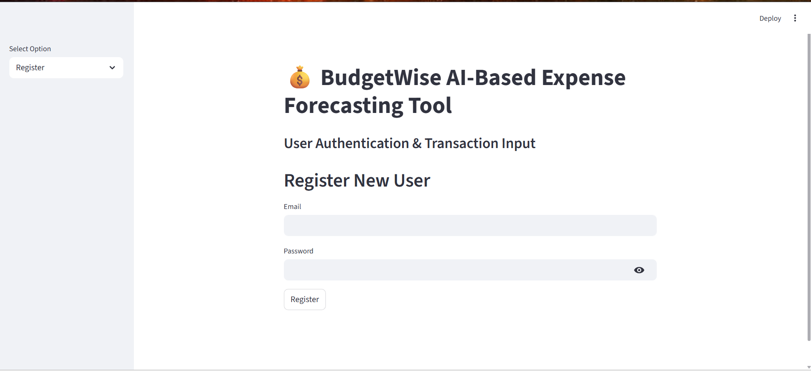
#### **2. Login System**
- Secure login authentication with JWT-based token generation.
- Session-based user identification to protect restricted routes.
- Proper handling of invalid or expired login attempts.
  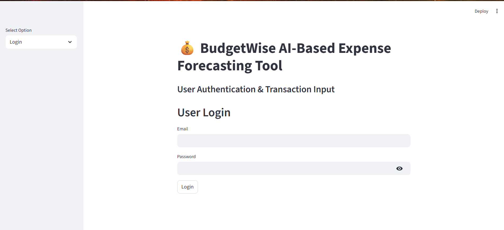

#### **3. Profile Management**
- Users can view and update profile details (name, email, and password).
- All updates are validated and securely processed.
- Each profile is linked to its user data via a relational user ID.

#### **4. Manual Transaction Input**
- Streamlit interface designed for user-friendly data entry.
- Input fields include:
  - Date  
  - Amount  
  - Description  
  - Type (Income / Expense)
- Data stored securely in the database and linked to the authenticated user.
   
---

### **Technological Implementation**
- **Frontend:** Streamlit forms and UI components for user interaction.
- **Backend:** Python-based logic with JWT authentication and database operations.
- **Database:** SQLite/MySQL for storing user and transaction data.
- **Security:** Password hashing with bcrypt and session validation using JWT.

---

### **Expected Outputs**
- Successful registration and login via Streamlit interface.
- Transaction input form storing dummy transactions in the database.
- Profile management and user-specific data display.

---

## **Milestone 2: Weeks 3–4**
### **Module 2: Transaction Categorization & Basic Reporting**

### **Objective**
To implement automated transaction categorization and visualization through analytical dashboards and summary reports.

---

### **High-Level Requirements**

#### **1. Automated Transaction Categorization**
- Rule-based categorization using keyword matching for identifying transaction types.
- Supported categories include:
  - Groceries  
  - Rent  
  - Transport  
  - Utilities  
  - Entertainment
- Users can manually modify category assignments if needed.
- Descriptions are processed to match relevant categories automatically.
  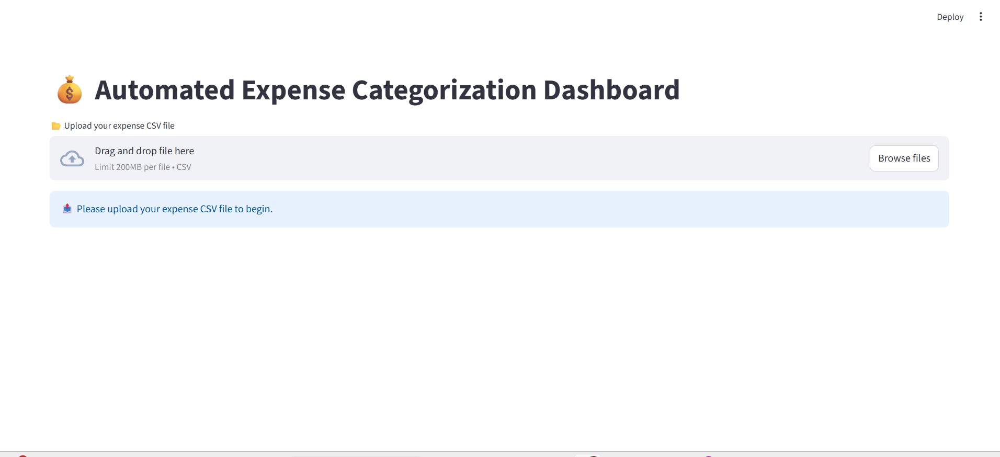

#### **2. Spending Summary Reports**
- Summarization using Pandas to generate:
  - Total spending per category.  
  - Monthly spending reports.  
  - Income vs. Expense analysis.
- Option to export spending summaries as CSV files.
- Integration of financial statistics for quick decision-making.
  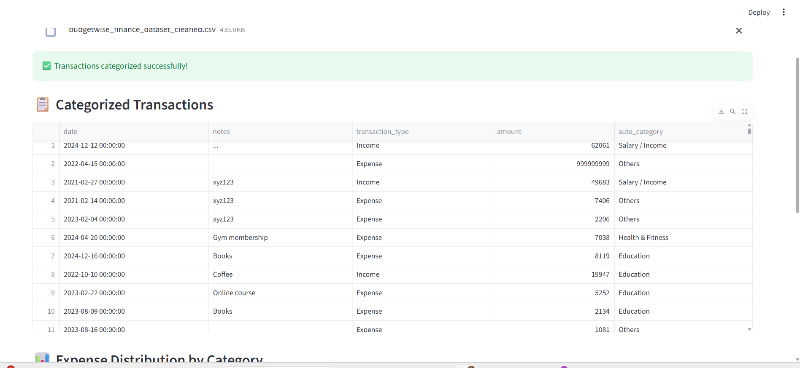
#### **3. Dashboard & Visualization**
- Streamlit dashboard displays real-time financial insights.
- Visual representation using Matplotlib and Seaborn.
- Charts include:
  - **Pie Chart:** Spending distribution by category.
- Filters and selectors for interactive data exploration.
  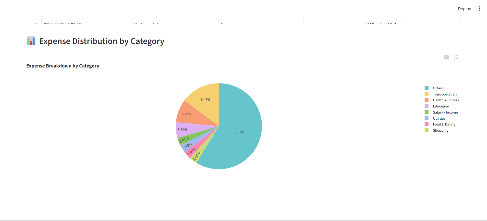
---

### **Technological Implementation**
- **Frontend:** Streamlit-based dashboard with visual analytics.
- **Backend:** Python logic for transaction categorization and report generation.
- **Database:** SQLite/MySQL for storing categorized transaction records.
- **Visualization Tools:**  
  - Matplotlib for static visual representation.  
  - Seaborn for aesthetically enhanced analytics charts.

---

### **Expected Outputs**
- Categorized transactions displayed in a structured table.
- Streamlit dashboard with:
  - Pie chart visualization for spending by category.  
  - Bar chart for monthly trends.  
  - Recent transactions overview.
- Exportable CSV summary reports for further analysis.
---

## **Key Achievements (Milestone 1 & 2)**
- Developed a **secure authentication system** using JWT and password hashing.  
- Implemented **user-friendly transaction input** via Streamlit forms.  
- Created **automated categorization logic** for expense classification.  
- Built **interactive dashboards** for financial insights using Matplotlib and Seaborn.  
- Generated **summary reports** for enhanced expense analysis and forecasting.

---
## **Milestone 3: **
### **Module 3: Forcasting Engine And Goal Setting**
### **Objective**
- Purpose: an interactive tool to load categorized expense history, set financial goals, and produce time-series expense forecasts per category using a statistical model.

- Primary users: individual consumers or financial planners who want goal-aligned savings guidance and category-level expense projections.

- Key outputs: daily/ monthly projected expense series, confidence intervals, a daily saving requirement for user goals, and an exported forecast CSV.

---

### **2. Environment & prerequisites**

  - List of runtime and external requirements to run the app:

  - Python runtime (specify version used in development).

  - Core libraries: Streamlit, pandas, Prophet (or fbprophet depending on packaging),  Plotly, and standard libraries for date/time and filesystem ops.

  - System permissions: ability to read CSV uploads and to write files to the configured export directory.

  - Recommended: virtual environment, explicit requirements.txt or pyproject.toml referencing exact package versions.
  
  ---

### **3. Application configuration (UI shell and page)**

   - Describe the page-level configuration and visual identity:

   - Page title and layout: app is registered with a descriptive title and uses a wide layout for improved visualization.

   -  Theming and CSS: custom CSS applied to set background, heading color palette, and to style primary action buttons for consistent CTAs.
---

### **4. User interface — high-level flow**

 - Sequential description of UI interactions:

    1. Landing header and brief context (title + separator).
    2. File upload control prompting the user to supply a categorized CSV.

    3. On successful upload, dataset preview (first few rows) is displayed.
    4. Goal-setting form where the user specifies goal name, target amount, completion date, and current saved amount.

    5. Goal summary & required daily savings computation shown after submission.
    6. Category selection and forecast horizon input (months) for the forecasting workflow.
    7. Visualization panel showing historical vs forecasted trend and confidence intervals.
    8. Forecast summary metrics (aggregate KPIs).

    9. Export confirmation when forecast is saved to disk.
---

### **5. Expected input data schema & validations**

  - Define expected format and the app’s validation logic:

  - Required columns: date, amount, auto_category.

  -  Date parsing: date must be ISO-like or parseable; invalid values are coerced to null/NaT.

  -  Amount parsing: amount must be numeric; invalids coerced and replaced (the app fills NAs with zero).

  -  Category extraction: auto_category is used to build the selection list and to filter the dataset.

  -  Short-data safeguard: forecasting requires a minimum of historical data points (the app warns if there are fewer than ~5 aggregated daily points).
---

### **6. Data preprocessing & aggregation**

  -  Step-by-step data transformations (abstracted):

  -  Convert user-supplied date strings to datetime objects.

  - Standardize numeric expense amounts and handle missing/invalid entries robustly.

  - For the selected category, group/aggregate expenses by date (daily aggregation), producing a time series suitable for model training.
      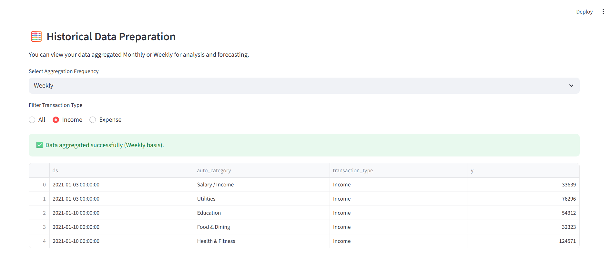
---
### **7. Financial goal module (behavioral logic)**

  - Explain the business logic and UX hints:

  - Inputs: goal name, target amount, target completion date, current saved amount.

  - Calculations:

         Remaining days = target date − current date.

         Remaining amount = target amount − current saved amount.

         Daily saving requirement = remaining amount ÷ remaining days (guard against zero/negative days).

   - UX: present formatted currency, target date in a human-friendly format, and an action confirmation.

      Edge cases: if the target date is in the past or remaining_days ≤ 0, communicate that the timeline is invalid and provide alternative recommendations (e.g., extend timeline or increase monthly savings).
      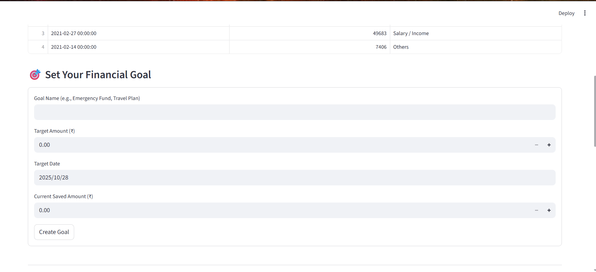
### **8. Forecasting engine (modeling workflow)**

 - Conceptual overview of forecasting steps:

   1. Model selection: a robust, seasonality-aware time-series model is instantiated.

   2. Model training: the model is fit on the historical daily aggregated expense series for the selected category.

   3. Future frame creation: a future date index is generated corresponding to the user-selected forecast horizon (converted to daily periods).

   4. Prediction: model predicts point estimates (yhat) and prediction intervals (yhat_lower, yhat_upper) for every day in the future frame.

   5. Output structure: predictions include central estimates and uncertainty bounds for each date.
   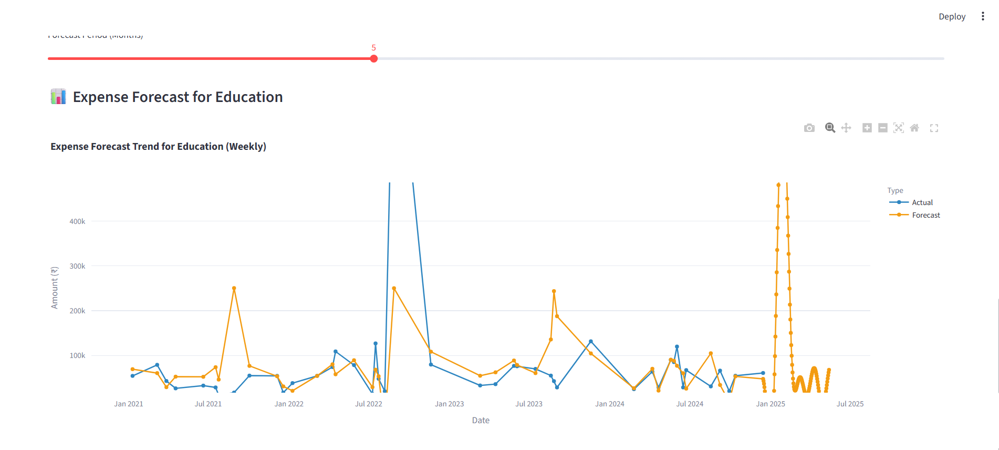
---
### ** 9. Interpretation of model outputs**

  Explain key terms and how to use them operationally:

    - yhat = the forecasted best estimate for expense on a given date.

    -  yhat_lower and yhat_upper = lower/upper bounds of the model’s prediction interval (representing model uncertainty; typically interpreted as a 95% credible/confidence interval unless configured differently).

    -  Business usage: use yhat for planning, and the interval bounds to create contingency budgets (worst-case planning uses yhat_upper).
---
### **10. Visualization & UX patterns

  Explain the charts and UI elements:

  - Combined line chart displays both historical (actual) and forecast (yhat) lines.

  -  Color differentiation: one color for historical, another for forecast to aid quick perception.

  -  Confidence intervals: shading or upper/lower boundary traces represent forecast uncertainty (important for risk-aware budgeting).

  -  KPI metrics: show average historical expense, mean projected expense over the forecast horizon, and the chosen forecast period in months.---
     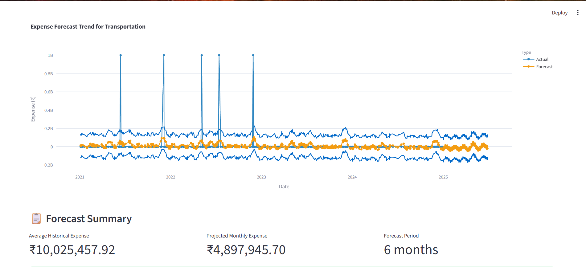

### **11. Persistence & export**

Describe saving behavior and filesystem considerations:

  - The app writes forecast results as a CSV to a configured relative directory (e.g., ../ml/data/forecast_results.csv).

  - Directory creation is performed if required.

  - Considerations: store unique exports per session (timestamped filenames) to avoid overwrites; implement download links directly in the UI for end-user convenience.

  - Security: ensure the export path is writable and safe; avoid writing to protected system locations.
  Milestone-4: Interactive Dashboard & Admin Dashboard — Functional Documentation

## **Milestone-4 :**
### **1. Objective**
focuses on implementing data-driven visualization and administrative oversight capabilities. The goal is to provide:

A User-facing Interactive Dashboard that enhances financial awareness and improves system usability.

An Admin Dashboard that enables operational governance, system monitoring, and user management.

Both dashboards are integrated with the existing backend API and database to ensure real-time insights and secure data handling.

---

### **2. System Architecture Overview**

The dashboards are connected to the existing backend service running on Flask with SQLite as the transactional datastore.
The backend exposes secured REST API endpoints that supply both user-level data and administrative-level datasets.

Data Flow:

1. User interactions trigger API requests.
2. Backend retrieves data from the SQLite database.
3. Dashboards render visualizations and management views based on returned data.
4. Administrative actions update the underlying records through authorized API calls.

This structure supports sustainable scalability and future integration with analytics engines or external data feeds.

---

## **3. Interactive User Dashboard**

3.1 Purpose

To provide a visually informed experience enabling users to:

Review their transaction history

Track spending patterns

Monitor financial activity across categories

Make informed budgeting decisions
For future Forcast it show the data result.

 for setting the goal form.
 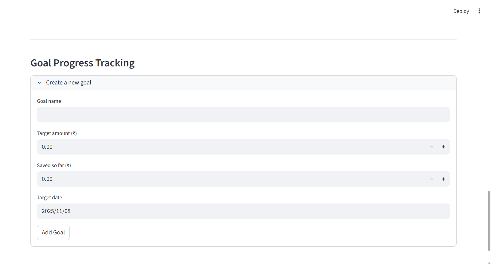

It also show the income vs expense trend
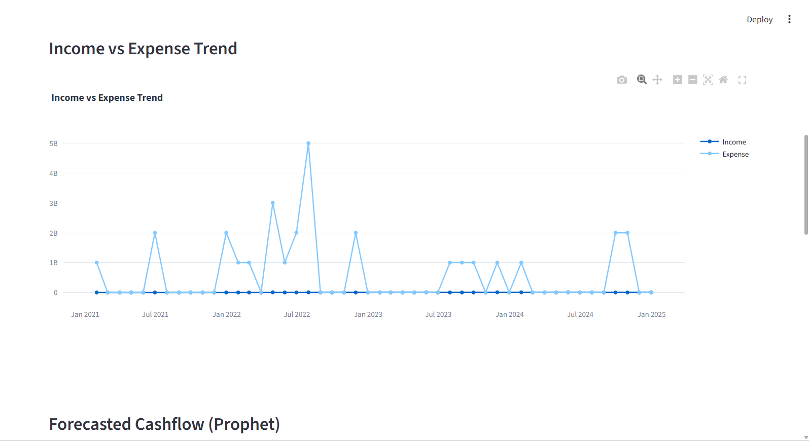

3.2 Key Features

Feature	Description	Business Value

Transaction Summary View	Displays past transactions with details such as category, amount, and date.	Enhances transparency and financial clarity.
Category-wise Spending Chart	Visualizes expenditure distribution across categories.	Supports budget awareness and cost optimization.
Monthly Trend Graph	Shows spending patterns over time.	Enables behavior insights and planning.

3.3 Data Consumption

The dashboard consumes:

GET /transaction/history
GET /transaction/summary

Responses are rendered into tabular formats and graphical charts.

---

## **4. Admin Dashboard**

4.1 Purpose

Designed to empower platform administrators with operational command and system visibility.
This dashboard ensures secure oversight, timely decision-making, and governance control.

4.2 Key Capabilities

Capability	Description	Outcome

User Management	View registered users; enable/disable access; perform account controls.	Maintains platform integrity and compliance.
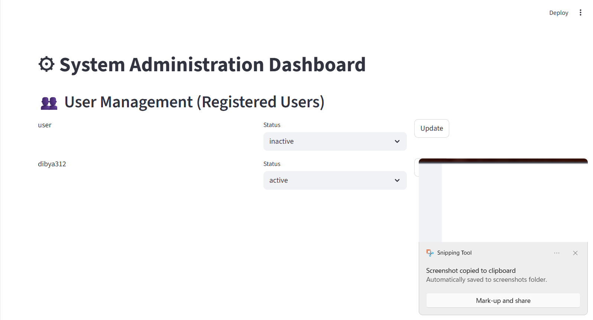
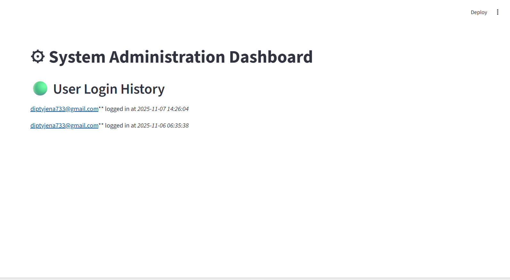
Transaction Oversight	Review all transactions across all users for audit and monitoring.	Enables anomaly detection and behavior evaluation.
Category Management	Create, update, or delete spending categories.	Facilitates structured data consistency.
System metrics for how much user login ,transcation all.
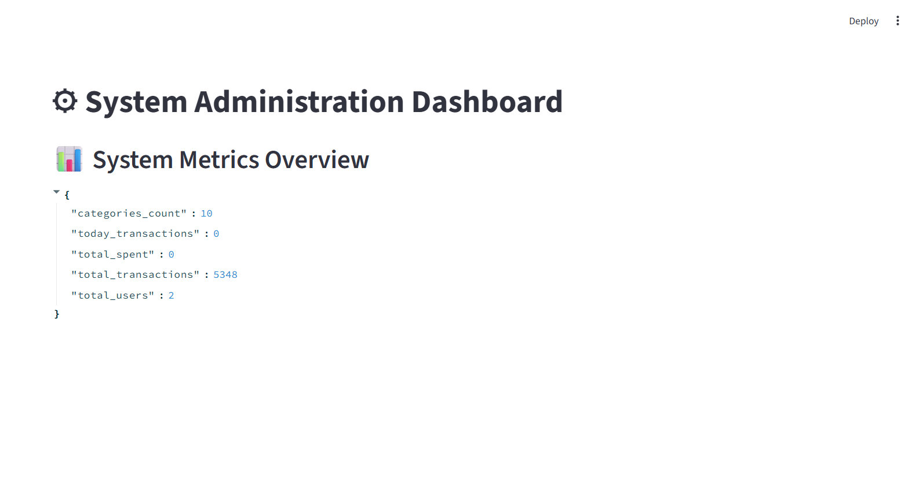
System Monitoring	Displays total users, transaction volume, and real-time load metrics.	Supports strategic scaling and performance tracking.
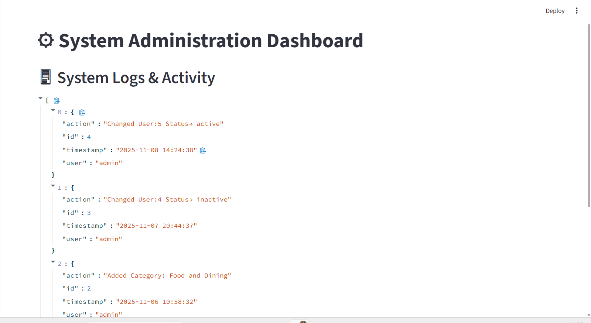

Also categoruze the section delete.update the things.
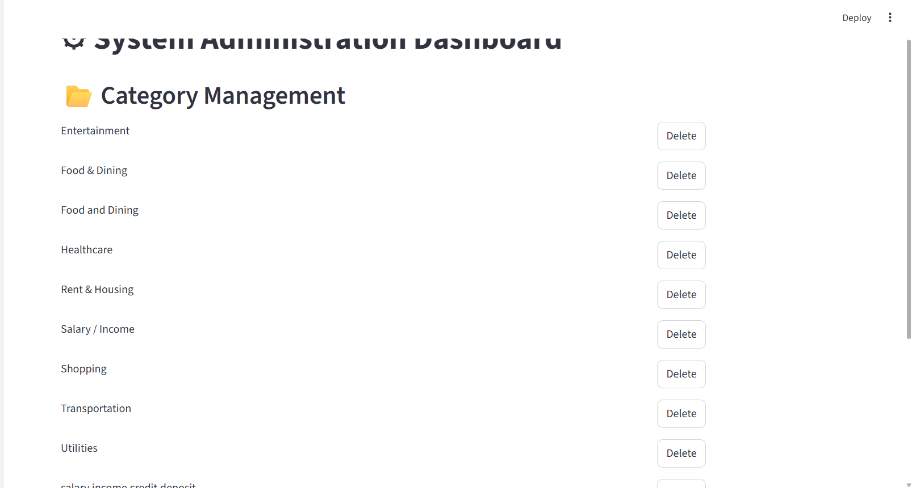

4.3 Core API Endpoints Used

GET  /admin/users
GET  /admin/transactions
GET  /admin/system
POST /admin/categories
PUT  /admin/users/<id>

These services operate under secure, role-controlled access policies.

---

## **5. Roles & Access Control**

Role	Dashboard Access	Permissions Scope

Regular User	User Dashboard	Personal data only
System Admin	Admin Dashboard	Global operations and oversight

Authentication tokens ensure that only authorized personnel access privileged interfaces.

---

## **6. User Experience Considerations**

Interfaces follow a clean, minimal visual language to support clarity and usability.
Navigation is structured for straightforward task execution.
Graphical elements utilize intuitive chart types for comprehension without technical interpretation.

---

## **7. Forward-Looking Enhancements**

To support continued maturity, the following enhancements are recommended:
Machine-learning based spending predictions
Smart budgeting recommendations
Real-time alerting for abnormal transactions
Multi-layer admin access (Tiered Authority Model)

These improvements position the platform for enterprise-grade adoption and enhanced user value.

---
## **System WorkFlow:-**

  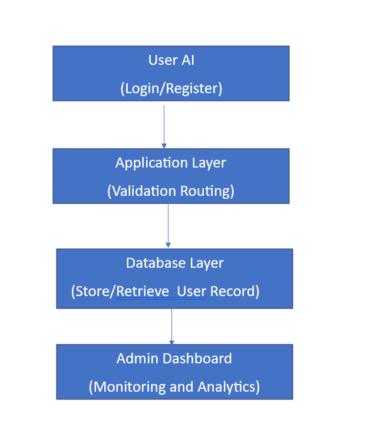

### **Data Flow Digarm:-**
## **Level-0:-**

  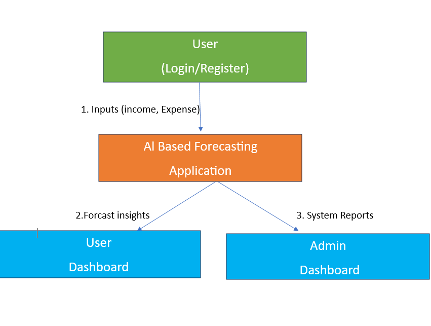

## **Level-1:-**
<pre>
                         ┌───────────────────────────────┐
                         │           User                 │
                         └───────┬───────────────────────┘
                                 │ User Registration/Login
                                 ▼
                        ┌───────────────────┐
                        │ Authentication     │
                        │   Module (JWT)     │
                        └───────┬────────────┘
                                │ User Identity
                                ▼
    ┌───────────────────────────────────────────────────────────────────┐
    │               Core Budget & Forecasting System                    │
    │                                                                   │
    │  ┌─────────────┐       2. Add Expense/Income     ┌─────────────┐  │
    │  │ User Inputs  ├───────────────────────────────▶│ Transaction  │  │
    │  │ (Forms/UI)   │                                │  Database   │  │
    │  └─────┬────────┘                                └──────┬─────┘  │
    │        │                                             Data │        │
    │        │                                           Retrieval      │
    │        ▼                                                 ▼        │
    │  ┌─────────────┐       3. ML Preprocessing       ┌──────────────┐ │
    │  │ Data Cleaner │──────────────────────────────▶ │  Forecasting  │ │
    │  │ & Normalizer │                                │   Engine      │ │
    │  └──────┬──────┘                                └──────────────┘ │
    │         │                                                   │     │
    │         ▼                                                   │     │
    │  ┌─────────────┐      4. Forecast Output                    │     │
    │  │ Chart/Graph │ ◀─────────────────────────────────────────┘     │
    │  │   Renderer  │                                                │
    │  └──────┬──────┘                                                │
    └─────────│───────────────────────────────────────────────────────┘
              │ 5. Insights Display
              ▼
        ┌───────────────┐
        │ User Dashboard │
        └───────────────┘

                         ┌──────────────────────────────┐
                         │           Admin               │
                         └───────┬──────────────────────┘
                                 │ View Metrics / Logs / Users
                                 ▼
                         ┌──────────────────────────────┐
                         │      Admin Dashboard          │
                         │  (User Mgmt, Categories, Logs)│
                         └──────────────────────────────┘
</pre>
## **Database Schema:-**
 Database Schema Structure

   1. users Table

    Stores all registered user details.
    Column Name	Data Type	Constraints	Description

     id	INT	Primary Key, Auto Increment	Unique identifier for each user 
     name	VARCHAR(100)	NOT NULL	Full name of the user
     email	VARCHAR(120)	NOT NULL, UNIQUE	User email for login.
     password	VARCHAR(255)	NOT NULL	Hashed password for authentication
     created_at	DATETIME	DEFAULT CURRENT_TIMESTAMP	Registration timestamp
     last_login	DATETIME	NULL	Tracks last login date/time
---
  2. admin Table

   Stores admin login accounts.
   Column Name	Data Type	Constraints	Description.

      id	INT	Primary Key, Auto Increment	Unique identifier for admin users
      username	VARCHAR(100)	NOT NULL, UNIQUE	Admin username
      email	VARCHAR(120)	NOT NULL, UNIQUE	Admin email
      password	VARCHAR(255)	NOT NULL	Hashed password
      role	VARCHAR(50)	DEFAULT 'super-admin'	Defines admin role privileges
      created_at	DATETIME	DEFAULT CURRENT_TIMESTAMP	Account creation timestamp
---

  3. user_login_logs Table

    Tracks login activity for audit monitoring on the Admin Dashboard.
    Column Name	Data Type	Constraints	Description

     log_id	INT	Primary Key, Auto Increment	Unique record of login event
     user_id	INT	Foreign Key → users(id)	Logged-in user reference
     login_time	DATETIME	DEFAULT CURRENT_TIMESTAMP	Time of login
     status	VARCHAR(20)	DEFAULT 'success'	Success or failed attempt
---
## **Future Enhancment:-**
As the platform evolves, several scalable and high-impact enhancements can be implemented to further strengthen usability, security, and intelligence capabilities. These forward-looking improvements are designed to support long-term product growth, operational efficiency, and end-user value.

 1. AI-Driven Expense Prediction Optimization
  Enhance the forecasting engine by adopting:
  Advanced machine learning models (LSTM, Prophet Tuning, ARIMA Auto-Optimization)
  Real-time behavioral pattern learning
  Adaptive thresholding for alert generation/
2. Secure Multi-Device & Cloud Sync Support
  Implement secure encrypted data sync across:
  Mobile applications (Android / iOS)
  Web dashboard
  Distributed storage layer (AWS / Azure / GCP)
3. Multi-Tenant Role-Based Admin Control
   Extend admin dashboard functionalities to support:
   Tiered access roles (Super Admin, Manager, Auditor)
  More granular permission allocation
  Workplace or organization-level user onboarding
 This upgrade improves governance, audit compliance, and operational transparency.
4. Intelligent Fraud / Anomaly Detection
  Deploy machine learning anomaly engines to flag:
  Irregular spending spikes
  Duplicate transactions
  Possible unauthorized access or misuse
  This adds a predictive security dimension to the platform..
5. Integrations with External Financial Institutions
   Enable API-based integrations with:
   Banking systems (UPI/Net Banking API)
   Payment wallets (Google Pay, PhonePe, Paytm)
   Accounting and tax modules
   This will enhance accessibility and enable seamless continuity across devices.
## **8. Version Control and Professional Practice**

• Version Control managed through Git and GitHub.  
• Repository URL: https://github.com/dipty09/Budget-wise-AI-based-Expese-Forcasting-Tool  
• Development workflow maintained via feature branches, merged into main after review.  
• Live Demo: Includes Streamlit app examples and Python scripts for model demonstrations.

---
## **9. Conclusion**
The BudgetWise Expense Management System successfully integrates secure authentication, automated transaction processing, intelligent expense forecasting, and an interactive visualization dashboard. The admin panel further enables oversight of user activity and category management, ensuring operational transparency. The solution provides users with clear financial insights and supports smarter budgeting decisions. The system is scalable and can be extended with advanced AI recommendations, mobile app integration, and real-time financial alerts to enhance long-term usability and impact.

## **Author Information**

Developer: Dipty  
Project Type: AI / ML + Data Science  
Technology Stack: Python, Streamlit, Flask, Pandas, Prophet,numpy, LSTM  

--------------------------------------------------
